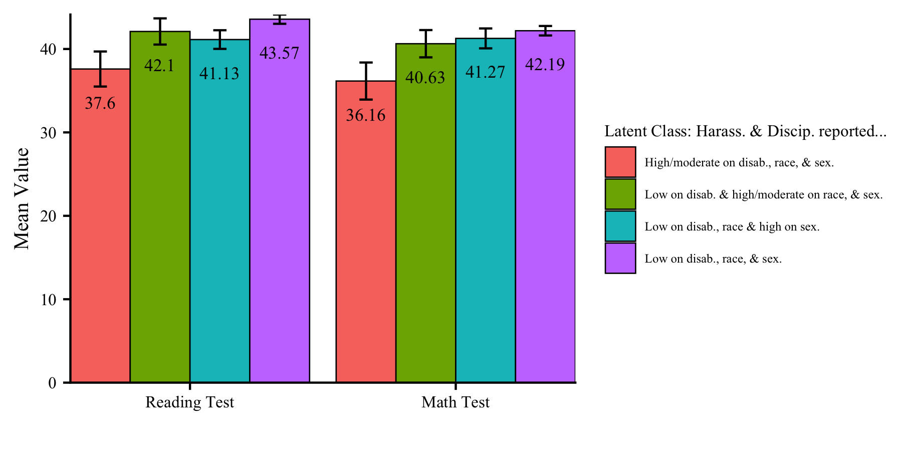

```{r setup, include=FALSE}
knitr::opts_chunk$set(echo = TRUE, eval=FALSE, message = FALSE, warning = FALSE)
library(knitr); library(gt); library(tidyverse) 
```

# --------------------------------------------------------------------------------------

```{r, echo=FALSE, eval=TRUE, fig.align='center', out.width="40%"}
include_graphics("figures/IESNewLogo.jpg")
```

The Institute of Mixture Modeling for Equity-Oriented Researchers, Scholars, and Educators (`IMMERSE`) is an IES funded training grant (R305B220021) to support education scholars in integrating mixture modeling into their research.

> Visit our [$\color{blue}{\text{Website}}$](https://immerse.education.ucsb.edu/) to learn more about the IMMERSE project.

> Follow us on [$\color{blue}{\text{Twitter}}$](https://twitter.com/IMMERSE_UCSB) for updates on posted resources!

> Visit our [$\color{blue}{\text{GitHub}}$](https://github.com/immerse-ucsb/) account to follow along with this tutorial & others. 

# --------------------------------------------------------------------------------------

> This `R` tutorial automates the BCH two-step auxiliary variable procedure (Bolk, Croon, Hagenaars, 2004) using the `MplusAutomation` package (Hallquist & Wiley, 2018) to estimate models and extract relevant parameters. To learn more about auxiliary variable integration methods and why multi-step methods are necessary for producing un-biased estimates see Asparouhov & Muthén (2014). 

# --------------------------------------------------------------------------------------

**Follow along! Link to `Github` repository:**

$\color{blue}{\text{https://github.com/immerse-ucsb/BCH-MplusAuto}}$

### Data Source: Civil Rights Data Collection (CRDC)

> The CRDC is a federally mandated school and district level data collection effort that occurs every other year. This public data is currently available for selected variables across 4 years (2011, 2013, 2015, 2017) and all US states. In the following tutorial six focal variables are utilized as indicators of the latent class model; three variables which report on harassment/bullying in schools based on disability, race, or sex, and three variables on full-time equivalent school staff employees (counselor, psychologist, law enforcement). For this example, we utilize a sample of schools from the state of Arizona reported in 2017.

**Information about CRCD:** https://www2.ed.gov/about/offices/list/ocr/data.html

**Data access (`R`):** https://github.com/UrbanInstitute/education-data-package-r

# --------------------------------------------------------------------------------------

```{r, eval=TRUE, echo=FALSE}
### Take a look at the indicators that compose the LCA ###

tribble(
~"Name", ~"Description", 
#----------|-------------|,
"report_dis"  , "Number of students harassed or bullied on the basis of disability" ,
"report_race" , "Number of students harassed or bullied on the basis of race, color, or national origin " ,
"report_sex" , "Number of students harassed or bullied on the basis of sex" ,
"counselors_fte"  , "Number of full time equivalent counselors hired as school staff" ,
"psych_fte"   , " Number of full time equivalent psychologists hired as school staff" ,
"law_fte"   , "Number of full time equivalent law enforcement officers hired as school staff" ,
"lunch_program"   , "School has a lunch program (0=No lunch program, 1=Lunch program at school).",
"read_test"   , "Average reading test assessment score at school",
"math_test" , "Average math test assessment score at school" ) %>% 
gt() %>% 
tab_header(title = md("**LCA Indicators & Auxiliary Variables: Harassment & Staff Example**"), subtitle = md("&nbsp;")) %>%
tab_row_group(group = "LCA Indicator Variables", rows = 1:6) %>% 
tab_row_group(group = "Auxiliary Variables", rows = 7:9) %>%
row_group_order(groups = c("LCA Indicator Variables","Auxiliary Variables")) %>% 
tab_options(column_labels.font.weight = "bold", row_group.font.weight = "bold") %>% 
tab_footnote(
  footnote = md("*Note*. Data souce is from the public-use dataset, the *Civil Rights Data Collection* (CRDC; US Department of Education Office for Civil Rights, 2014)"),locations = cells_title())

```

# --------------------------------------------------------------------------------------

Load packages
```{r, eval=TRUE}
library(MplusAutomation)  # a conduit between R & Mplus
library(here)             # to locate or send files within the Rproject folder
library(gt)               # for pretty tables
library(tidyverse)        # for everything else...
```

Read in CSV data file from the `data` subfolder
```{r}

bch_data <- read_csv(here("data", "crdc_aux_data.csv"))

```

# --------------------------------------------------------------------------------------

## EXAMPLE 1: "Manual BCH Two-step" Auxiliary Variable Integration Method

# --------------------------------------------------------------------------------------


### Step 1 - Estimate the unconditional model with all covariate & distal outcome variables mentioned in the `auxiliary` statement. 

```{r}
m_step1  <- mplusObject(
  TITLE = "Step1_bch_automation", 
  VARIABLE = 
   "categorical = report_dis report_race report_sex counselors_fte psych_fte law_fte; 
   
    usevar = report_dis report_race report_sex counselors_fte psych_fte law_fte;
    
    classes = c(3); 
    
    !!! NOTE: All auxiliary variables to be considered in the final model should be listed here !!!
    auxiliary = 
    lunch_program read_test math_test;",
  
  ANALYSIS = 
   "estimator = mlr; 
    type = mixture; 
    starts = 500 100;",
  
  SAVEDATA = 
   "File=bch_crdc.dat;
    save=bchweights; 
    format=free;
    Missflag= 999;",
  
  usevariables = colnames(bch_data),
  rdata = bch_data)

m_step1_fit <- mplusModeler(m_step1,
                 dataout=here("bch_mplus", "step1_bch.dat"),
                 modelout=here("bch_mplus", "step1_bch.inp") ,
                 check=TRUE, run = TRUE, hashfilename = FALSE)
```

# --------------------------------------------------------------------------------------

### Extract saved data from the step 1 unconditional model.

# --------------------------------------------------------------------------------------


Extract saved data from the step 1 model `mplusObject` named "m_step1_fit"
```{r}

savedata <- as.data.frame(m_step1_fit[["results"]]
                                     [["savedata"]])
```


# --------------------------------------------------------------------------------------

### Step 2 - Estimate the model with auxiliary variables using BCH weights 

Example demonstrated is a model with a covariate control variable & two distal outcomes.

# --------------------------------------------------------------------------------------

**Specification details:**

- This example contains two distal outcome variables (`read_tes` & `math_tes`) and one binary covariate (`lunch_pr`).
- Under each class-specific statement (e.g., `%C#1%`) the distal outcome is mentioned to estimate the intercept mean (in square brackets) & variance parameters. 
- Note that the binary covariate is centered so that reported distal means (intercepts) are estimated at the weighted average of `lunch_pr`.

```{r}

m_step2  <- mplusObject(
  TITLE = "Step2_bch_automation", 
  
  VARIABLE = 
 "usevar = BCHW1-BCHW3 lunch_pr read_tes math_tes;
  missing are all (999); 
  classes = c(3); 
  training = BCHW1-BCHW3(bch); ",
 
  DEFINE =
  "center lunch_pr (grandmean);",
  
  ANALYSIS = 
 "estimator = mlr; 
  type = mixture; 
  starts = 0;",
  
  MODEL =
 "!!! DISTAL OUTCOMES = read_tes math_tes !!!
  !!! COVARIATE = lunch_pr !!!
  
  %OVERALL%
  
  c on lunch_pr;                 !!! estimate covariate as predictor of latent class !!!
  read_tes;
  math_tes;

  %C#1%

  [read_tes](m01);               !!! estimate conditional intercept mean !!!
  read_tes;                      !!! estimate conditional intercept variance !!!

  [math_tes] (m1);
  math_tes;

  %C#2%

  [read_tes](m02);
  read_tes;

  [math_tes] (m2);
  math_tes;
  
  %C#3%

  [read_tes](m03);
  read_tes;

  [math_tes] (m3);
  math_tes;  ",
  
  MODELCONSTRAINT = 
 "New (rdiff12 rdiff13
  rdiff23 mdiff12 mdiff13
  mdiff23);

  rdiff12 = m1-m2;   mdiff12 = m01-m02;
  rdiff13 = m1-m3;   mdiff13 = m01-m03;
  rdiff23 = m2-m3;   mdiff23 = m02-m03; ",
  
  MODELTEST =
  ## NOTE: Only a single Wald test can be conducted per model run. Therefore, 
  ## this example requires running separate models for each omnibus test (e.g.,
  ## 4 models; 2 outcomes and 2 slope coefficients). This can be done by
  ## commenting out all but one test and then making multiple input/output files.
   
 "m01=m02;    !!! Distal outcome omnibus Wald test for `read_tes` !!!
  m02=m03;
  
  ! m1=m2;       !!! Distal outcome omnibus Wald test for `math_tes` !!!
  ! m2=m3;       !!! COMMENTED OUT: RUN SEPRATELY !!!

  ",
 
  usevariables = colnames(savedata), 
  rdata = savedata)

m_step2_fit <- mplusModeler(m_step2,
                 dataout=here("bch_mplus", "step2_bch_distals.dat"), 
                 modelout=here("bch_mplus", "step2_bch_distals.inp"), 
                 check=TRUE, run = TRUE, hashfilename = FALSE)
```

> NOTE: Result is inadmissible due to a negative variance estimated for the covariate parameter. This is a known limitation when using the BCH in the context of mixture models with high classification error (low entropy). Such models produce negative BCH weights which often cause the solution to be inadmissible. In this case the 3-step ML approach should be used. 

**End of 2-Step BCH procedure.**

# --------------------------------------------------------------------------------------

## EXAMPLE 2: Harassment & Discipline LCA indicators (4-class solution)

# --------------------------------------------------------------------------------------

Read in CSV data file from the `data` subfolder
```{r}

bch_ex2_data <- read_csv(here("data", "crdc_example2_data.csv"))

```

# --------------------------------------------------------------------------------------

```{r, eval=TRUE, echo=FALSE}
### Take a look at the indicators that compose the LCA (EXAMPLE 2) ###

tribble(
~"Name", ~"Description", 
#----------|-------------|,
"report_dis","Number of students harassed or bullied on the basis of disability" ,
"discip_dis","Number of students disciplined for bullying or harassment on the basis of disability" ,
"report_race","Number of students harassed or bullied on the basis of race, color, or national origin " ,
"discip_race","Number of students disciplined for bullying or harassment on the basis of race, color, or national origin ",
"report_sex","Number of students harassed or bullied on the basis of sex" ,
"discip_sex","Number of students disciplined for bullying or harassment on the basis of sex" ,
"lunch_program","School has a lunch program (0=No lunch program, 1=Lunch program at school).",
"read_test","Average reading test assessment score at school",
"math_test","Average math test assessment score at school" ) %>% 
gt() %>% 
tab_header(title = md("**LCA Indicators & Auxiliary Variables: Harassment & Discipline Example**"),
           subtitle = md("&nbsp;")) %>%
tab_row_group(group = "LCA Indicator Variables", rows = 1:6) %>% 
tab_row_group(group = "Auxiliary Variables", rows = 7:9) %>%
row_group_order(groups = c("LCA Indicator Variables","Auxiliary Variables")) %>% 
tab_options(column_labels.font.weight = "bold", row_group.font.weight = "bold") %>% 
tab_footnote(
  footnote = md("*Note*. Data souce is from the public-use dataset, the *Civil Rights Data Collection* (CRDC; US Department of Education Office for Civil Rights, 2014)"),locations = cells_title())

```

### Step 1 - Estimate the unconditional model with all covariate & distal outcome variables mentioned in the `auxiliary` statement. 

```{r}
m_step1  <- mplusObject(
  TITLE = "Step1_bch_automation (example 2)", 
  VARIABLE = 
   "categorical = report_dis discip_dis report_race discip_race report_sex discip_sex; 
   
    usevar = report_dis discip_dis report_race discip_race report_sex discip_sex;
    
    classes = c(4); 
    
    !!! NOTE: All auxiliary variables to be considered in the final model should be listed here !!!
    auxiliary = 
    lunch_program read_test math_test;",
  
  ANALYSIS = 
   "estimator = mlr; 
    type = mixture; 
    starts = 500 100;",
  
  SAVEDATA = 
   "File=bch_crdc_ex2.dat;
    save=bchweights; 
    format=free;
    Missflag= 999;",
  
  usevariables = colnames(bch_ex2_data),
  rdata = bch_ex2_data)

m_step1_fit <- mplusModeler(m_step1,
                 dataout=here("bch_ex2_mplus", "step1_bch_ex2.dat"),
                 modelout=here("bch_ex2_mplus", "step1_bch_ex2.inp") ,
                 check=TRUE, run = TRUE, hashfilename = FALSE)
```

# --------------------------------------------------------------------------------------

### Extract saved data from the step 1 unconditional model.

# --------------------------------------------------------------------------------------


Extract saved data from the step 1 model `mplusObject` named "m_step1_fit"
```{r}

savedata <- as.data.frame(m_step1_fit[["results"]]
                                     [["savedata"]])
```

# --------------------------------------------------------------------------------------

### Step 2 - Estimate the model with auxiliary variables using BCH weights 

Example demonstrated is a model with a covariate control variable & two distal outcomes.

# --------------------------------------------------------------------------------------

**Specification details:**

- This example contains two distal outcome variables (`read_tes` & `math_tes`) and one binary covariate (`lunch_pr`).
- Under each class-specific statement (e.g., `%C#1%`) the distal outcome is mentioned to estimate the intercept mean (in square brackets) & variance parameters. 
- Note that the binary covariate is centered so that reported distal means (intercepts) are estimated at the weighted average of `lunch_pr`.

```{r}

m_step2  <- mplusObject(
  TITLE = "Step2_bch_automation (example 2)", 
  
  VARIABLE = 
 "usevar = BCHW1-BCHW4 lunch_pr read_tes math_tes;
  missing are all (999); 
  classes = c(4); 
  training = BCHW1-BCHW4(bch); ",
 
  DEFINE =
  "center lunch_pr (grandmean);",
  
  ANALYSIS = 
 "estimator = mlr; 
  type = mixture; 
  starts = 0;",
  
  MODEL =
 "!!! DISTAL OUTCOMES = read_tes math_tes !!!
  !!! COVARIATE = lunch_pr !!!
  
  %OVERALL%
  
  c on lunch_pr;                 !!! estimate covariate as predictor of latent class !!!
  read_tes;
  math_tes;

  %C#1%

  [read_tes](m01);               !!! estimate conditional intercept mean !!!
  read_tes;                      !!! estimate conditional intercept variance !!!

  [math_tes] (m1);
  math_tes;

  %C#2%

  [read_tes](m02);
  read_tes;

  [math_tes] (m2);
  math_tes;
  
  %C#3%

  [read_tes](m03);
  read_tes;

  [math_tes] (m3);
  math_tes;  
 
  %C#4%

  [read_tes](m04);
  read_tes;

  [math_tes] (m4);
  math_tes;  ",
  
  MODELCONSTRAINT = 
 "New (rdiff12 rdiff13 rdiff14 rdiff23 
  rdiff24 rdiff34 mdiff12 mdiff13 mdiff14
  mdiff23 mdiff24 mdiff34
  );

  rdiff12 = m1-m2;   mdiff12 = m01-m02;
  rdiff13 = m1-m3;   mdiff13 = m01-m03;
  rdiff14 = m1-m4;   mdiff14 = m01-m04;
  rdiff23 = m2-m3;   mdiff23 = m02-m03; 
  rdiff24 = m2-m4;   mdiff24 = m02-m04; 
  rdiff34 = m3-m4;   mdiff34 = m03-m04; 
 ",
  
  MODELTEST =
  ## NOTE: Only a single Wald test can be conducted per model run. Therefore, 
  ## this example requires running separate models for each omnibus test (e.g.,
  ## 4 models; 2 outcomes and 2 slope coefficients). This can be done by
  ## commenting out all but one test and then making multiple input/output files.
   
 "m01=m02;    !!! Distal outcome omnibus Wald test for `read_tes` !!!
  m02=m03;
  m03=m04;
 
  ! m1=m2;    !!! Distal outcome omnibus Wald test for `math_tes` !!!
  ! m2=m3;    !!! COMMENTED OUT: RUN SEPRATELY !!!
  ! m3=m4;

  ",
 
  usevariables = colnames(savedata), 
  rdata = savedata)

m_step2_fit <- mplusModeler(m_step2,
                 dataout=here("bch_ex2_mplus", "step2_bch_ex2.dat"), 
                 modelout=here("bch_ex2_mplus", "step2_bch_ex2.inp"), 
                 check=TRUE, run = TRUE, hashfilename = FALSE)
```

**End of 2-Step BCH procedure.**

# --------------------------------------------------------------------------------------

```{r, echo=FALSE, eval=TRUE, fig.align='center', out.width="100%"}


```

# --------------------------------------------------------------------------------------

## Visualize results:

> NOTE: The next video in this series will include a detailed tutorial on how to interpret auxiliary variable output (i.e. distal outcomes & covariates) in the context of moderation. This tutorial will also cover `R` code to generate figures for visualizing the results. 

# --------------------------------------------------------------------------------------

## References

**How to reference this tutorial:** Garber, A. C. (2021). BCH Two-step Auxiliary Variable Integration Using MplusAutomation. Retrieved from [$\color{blue}{\text{https://psyarxiv.com/wmfcj}}$](https://psyarxiv.com/wmfcj)

# --------------------------------------------------------------------------------------

Asparouhov, T., & Muthén, B. O.
(2014). 
Auxiliary variables in mixture modeling: Three-step approaches using Mplus. 
Structural Equation Modeling, 21, 329–341. http://dx.doi.org/10.1080/10705511.2014.915181

Bolck, A., Croon, M., & Hagenaars, J. 
(2004). 
Estimating latent structure models with categorical variables: One-step versus three-step estimators. 
Political Analysis, 12(1), 3-27.

Hallquist, M. N., & Wiley, J. F.
(2018).
MplusAutomation: An R Package for Facilitating Large-Scale Latent Variable Analyses in Mplus.
Structural Equation Modeling: a multidisciplinary journal, 25(4), 621-638.

Müller, Kirill. 
(2017).
Here: A Simpler Way to Find Your Files. 
https://CRAN.R-project.org/package=here.

Muthén, B. O., Muthén, L. K., & Asparouhov, T.
(2017).
Regression and mediation analysis using Mplus.
Los Angeles, CA: Muthén & Muthén.

Muthén, L.K.
and Muthén, B.O.
(1998-2017).
Mplus User's Guide.
Eighth Edition. Los Angeles, CA: Muthén & Muthén

US Department of Education Office for Civil Rights.
(2014). 
Civil rights data collection data snapshot: School discipline. 
Issue brief no. 1.

R Core Team (2017).
R: A language and environment for statistical computing.
R Foundation for Statistical Computing, Vienna, Austria.
URL <http://www.R-project.org/>

Wickham et al., (2019).
Welcome to the tidyverse.
Journal of Open Source Software, 4(43), 1686, <https://doi.org/10.21105/joss.01686>

Wickham H et al., (2019). "Welcome to the tidyverse." Journal of Open Source Software, 4(43), 1686. doi: 10.21105/joss.01686.

# --------------------------------------------------------------------------------------


